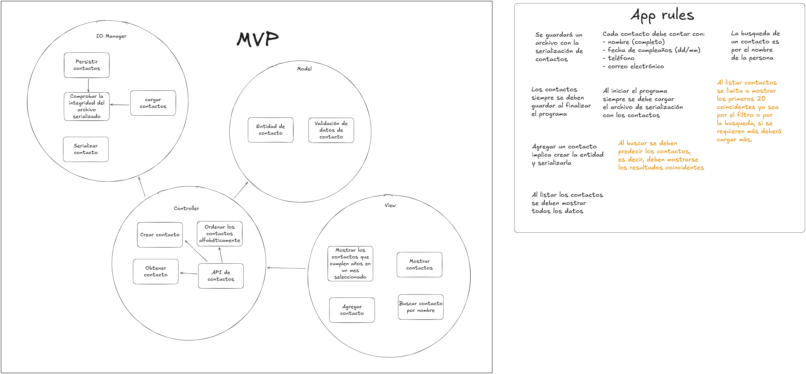

# 📇 ContactManager-Lua-

> **Gestión de contactos en Lua**  
> 

✨ **Proyecto universitario** para crear, consultar, actualizar, listar y filtrar contactos desde una interfaz de línea de comandos, con persistencia en archivo CSV y arquitectura modular.

---

## 🗂️ Descripción de módulos principales

-   `📄 src/model/contact.lua`: Define la clase Contacto y su validación.
-   `🛡️ src/model/validation.lua`: Funciones para validar los datos de los contactos (nombre, email, teléfono, cumpleaños).
-   `🧩 src/controller/contact_controller.lua`: Controlador principal que gestiona la lógica de creación, obtención, actualización y listado de contactos.
-   `🔧 src/controller/services/`: Servicios individuales para crear, obtener, ordenar y filtrar contactos por cumpleaños.
-   `💾 src/controller/persistence/io_manager.lua`: Módulo encargado de la persistencia de los contactos en archivo CSV.
-   `🖥️ src/view/main.lua`: Interfaz de línea de comandos para interactuar con el usuario.
-   `👁️ src/view/view.lua`: Funciones auxiliares para mostrar menús y mensajes al usuario.

---

## 📦 ¿Dónde se guardan los contactos?

Los contactos se almacenan en:

```
📁 src/files/contactos.csv
```

---

## 🚀 ¿Cómo ejecutar el proyecto?

1. 🛠️ Asegúrate de tener [Lua](https://www.lua.org/download.html) instalado y agregado al PATH.
2. 💻 Abre una terminal en la raíz del proyecto (donde está este README).
3. ▶️ Ejecuta el siguiente comando:

```sh
lua src/view/main.lua
```

Sigue las instrucciones del menú para gestionar tus contactos.

---

## 🏗️ Estructura del proyecto

```
repository/
├── README.md
├── src/
│   ├── model/
│   │   ├── contact.lua
│   │   └── validation.lua
│   ├── controller/
│   │   ├── contact_controller.lua
│   │   ├── persistence/
│   │   │   └── io_manager.lua
│   │   └── services/
│   │       ├── crear_contacto.lua
│   │       ├── obtener_contacto.lua
│   │       ├── obtener_contactos_ordenados.lua
│   │       └── obtener_por_birthday.lua
│   ├── files/
│   │   └── contactos.csv
│   ├── view/
│   │   ├── main.lua
│   │   └── view.lua
│   └── test/
│       └── contact_controller_test.lua
└── artifacts/
    └── arch/
        └── AppRules_Architecture.png
```

---

## 🏛️ Arquitectura y diseño

> **Patrón:** `MVP (Model-View-Presenter/Controller)`

-   **Model**: 📄 Define la entidad de contacto y la validación de sus datos.
-   **Controller**: 🧩 Gestiona la lógica de negocio, la creación, obtención, actualización y ordenamiento de contactos, y actúa como intermediario entre la vista y el modelo.
-   **IO Manager**: 💾 Se encarga de la persistencia, serialización y carga de los contactos desde/para el archivo CSV, asegurando la integridad de los datos.
-   **View**: 🖥️ Proporciona la interfaz de usuario (CLI), mostrando menús, mensajes y resultados, y recolectando la entrada del usuario.

### 📐 Reglas y diseño

-   📝 Los contactos se serializan y guardan en un archivo CSV.
-   🔄 Al iniciar el programa, se cargan todos los contactos desde el archivo.
-   🧑‍💼 Cada contacto debe tener: nombre, cumpleaños (dd/mm), teléfono y correo electrónico.
-   🔍 Al buscar, se muestran los resultados coincidentes (predicción).
-   📋 Al listar, se muestran los primeros 20 contactos coincidentes (por filtro o búsqueda); si hay más, se pueden cargar más.
-   ➕ Al agregar un contacto, se valida y serializa la entidad.
-   👁️ Al listar, se muestran todos los datos de cada contacto.

El diseño modular y la arquitectura MVP facilitan la mantenibilidad, escalabilidad y pruebas del sistema.

---

> 🏷️ **Etiquetas:** #Lua #CLI #MVP #Contactos #Universidad #Persistencia #CSV #Validación #Arquitectura
